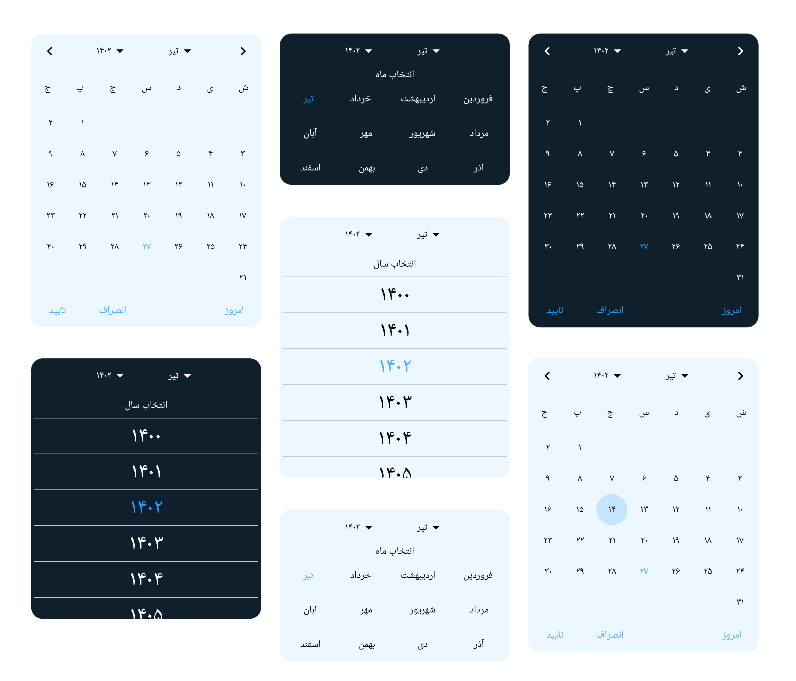
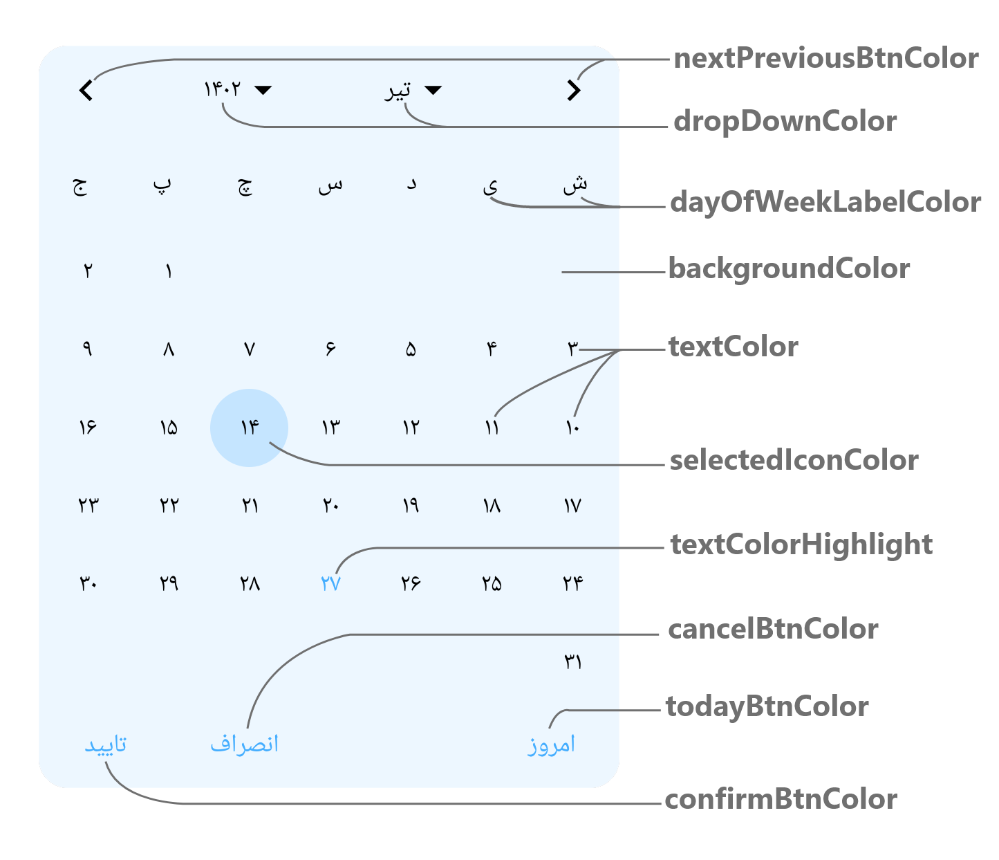
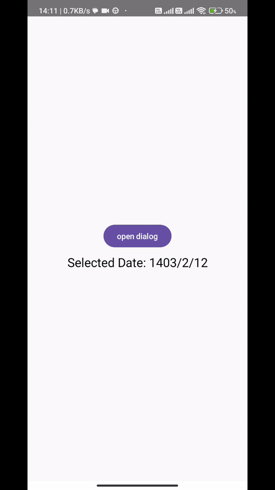

# jalali-datepicker-compose
An Android library - built with jetpack compose - that offers Jalali/Persian calendar date picker.
Easy to use, quick to implement and can be customized according to your application color and theme.



# Setup
Add the JitPack repository to settings.gradle file
```gradle
dependencyResolutionManagement {
    repositoriesMode.set(RepositoriesMode.FAIL_ON_PROJECT_REPOS)
    repositories {
        ...      
        maven { url 'https://jitpack.io' }
    }
}
```

Add the dependencies to app-level build.gradle file
```gradle
dependencies {
    ...
    implementation 'com.github.hamooo90:jalali-datepicker-compose:1.0.0'
    implementation 'ir.huri:JalaliCalendar:1.3.3'
}
```
This library uses another library called [JalaliCalendar](https://github.com/razeghi71/JalaliCalendar/tree/master "by razeghi71") to get, set and manipulate the dates. for more information on how to use it visit it's github page.

# How To Use

### Minimum Configuration
```kotlin
val openDialog = remember { mutableStateOf(false) }
JalaliDatePickerDialog(
    openDialog = openDialog,
    onSelectDay = { //it:JalaliCalendar
        Log.d("Date", "onSelect: ${it.day} ${it.monthString} ${it.year}")
    },
    onConfirm = {
        Log.d("Date", "onConfirm: ${it.day} ${it.monthString} ${it.year}")
    }
)
```

### With customization
```kotlin
JalaliDatePickerDialog(
    openDialog = openDialog,
    initialDate = JalaliCalendar(1402, 1, 2),
    onSelectDay = { //it:JalaliCalendar
        Log.d("Date", "onSelect: ${it.day} ${it.monthString} ${it.year}")
    },
    onConfirm = {
        Log.d("Date", "onConfirm: ${it.day} ${it.monthString} ${it.year}")
    },
    backgroundColor = Color.Yellow,
    textColor = Color.Blue
)
```

jalali datepicker colors can be changed with the use of these parameters


# Demo


